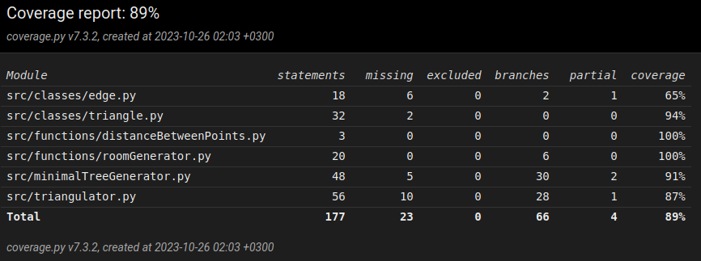

Testing the program has been done with automated tests and manual tests.

### Automated testing:
Automated testing as been done for the triangulator function, room generation functions and the minimum spanning tree functions.

The room generator functions have been tested by checking that the functions return lists with the right length and the objects in the lists are the correct type. The room generator has also been tested that it doesn't generate rooms that are overlapping.

The triangulator algorithm, has been tested by checking that the triangulation doesn't have any lines that cross, the triangulation contains all points given and that the triangulation is always the same for any the same points even if given in different order. The triangulation algorithm has been tested with set inputs. The algorithm doesn't always include all points if they are far enough away from each other.

The minimum spanning tree function has been tested by checking that it returns the correct number of lines.

### Manual testing 
The over all program has been tested manually. The visual drawing of the tunnels has also been tested manually.

### Running the tests
The instructions for running the tests can be found inside the [user manual](user_manual.md).

### Coverage

